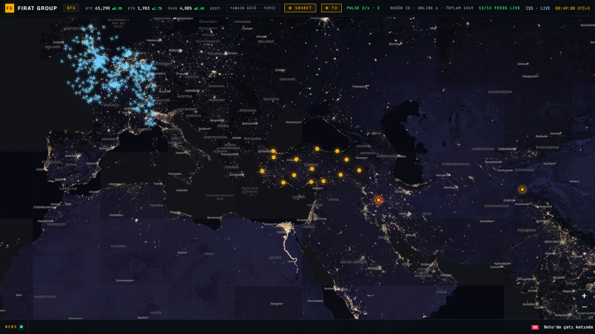
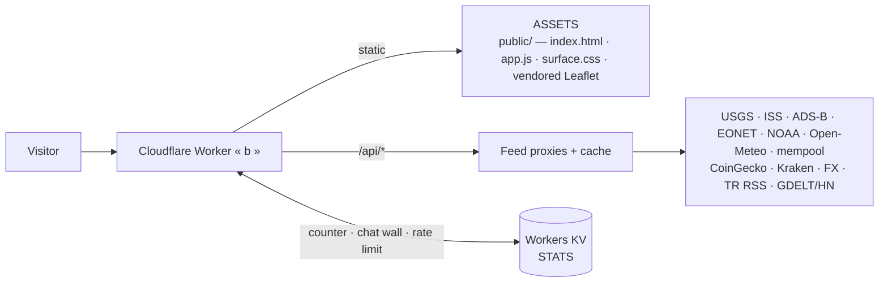

<div align="center">

# fsahin.com — WORLD TERMINAL

**A fullscreen live-data world map. No frameworks, no fake data, one Cloudflare Worker.**

[](https://fsahin.com)


[**► OPEN THE TERMINAL**](https://fsahin.com)



</div>

---

## What it is

The entire site is a map. No scroll, no pages — a dark command-terminal view of Earth
streaming **13 real data feeds**, rendered with vanilla JS and vendored Leaflet,
served by a single Cloudflare Worker.

*Türkçe: Sitenin tamamı canlı bir dünya haritası — 13 gerçek veri akışı, sıfır framework, tek Worker.*

## Live feeds — all real, no fallbacks faked

| Feed | Source |
|---|---|
| Earthquakes (M2.5+, 24h) | USGS |
| ISS position + track | wheretheiss.at |
| Live aircraft | airplanes.live · adsb.lol |
| Wildfire watch (TR region alarm) | NASA EONET |
| Space weather (planetary Kp) | NOAA SWPC |
| Weather + TR air quality (14 cities) | Open-Meteo |
| BTC mempool fees | mempool.space |
| Crypto prices | CoinGecko · Kraken |
| FX rates | Frankfurter · ER-API |
| Türkiye news ticker | TRT · AA · Hürriyet · CNN Türk RSS |
| Global news | GDELT (Hacker News fallback) |
| Visitor counter + chat wall | Workers KV — every count and message is a real visitor |

**SIGNAL LOST design:** when an upstream dies, the UI says `SIGNAL LOST` instead of
rendering stale or invented data. The identity panel's "no fabricated data" promise is
enforced in code — the chat wall launched empty and only ever shows real messages
(1 msg/min per IP via KV TTL, daily cap, fully escaped rendering).

## Architecture



One Worker does everything: serves the static shell, proxies and caches the upstream
feeds (browser never hits third parties directly), and owns a KV namespace for the
visitor counter and chat wall.

## Run it yourself

```bash
npm install
npx wrangler kv namespace create STATS   # paste the id into wrangler.jsonc
npm run dev                              # http://localhost:8787
npm run deploy
```

## License

MIT © Baran Fırat Şahin — [fsahin.com](https://fsahin.com)
